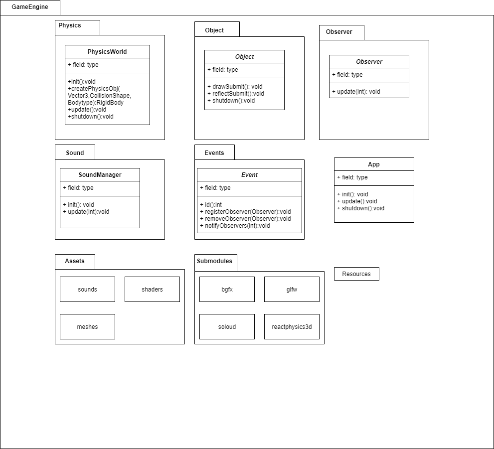

# D7049E
## Game Idea
- Third person perspective 
  - Control a character in the scene
- Puzzel/Exploring game
  - Build up your own home
  - Solve puzzels by finding and integrate with objects
  - Earn rewards (objects) by solving puzzels
  - Tile based placement system for the objects (choose between 2-4 options)
- Suitable background music depending on the environment
  - Special sound effects when interacting with objects
- Realistic movements such as walking, jumping and climbing 

## How to setup the project
This game engine was developed in C++ using CLion, here is how to setup the project in that environment:
1. Open the command line and run the following command:

    ``git clone --recurse-submodules -j8 https://github.com/wilkru-7/D7049E
   ``

2. Change the working directory to ``bgfx.cmake/bgfx/examples/runtime``. In CLion this is done from the "Edit configurations" in the Run menu.
3. Copy the bin files from ``assets/meshes`` and paste them into ``bgfx.cmake/bgfx/examples/runtime/meshes``.
4. Open the file ``soloud/contrib/Configure.cmake`` and disable SDL2 (line 17) and instead enable WASAPI (line 32).
5. Reload the cmake project and you should be set to build and run the executable called ``bgfx_test``.

## Development Environment
- 3D rendering library: BGFX
  - https://github.com/bkaradzic/bgfx
- Physics library: ReactPhysics3D
  - https://github.com/DanielChappuis/reactphysics3d
- Audio library: SoLoud
  - https://github.com/jarikomppa/soloud
  

## Other
- Background music source: https://freesound.org/people/ShadyDave/sounds/325611/